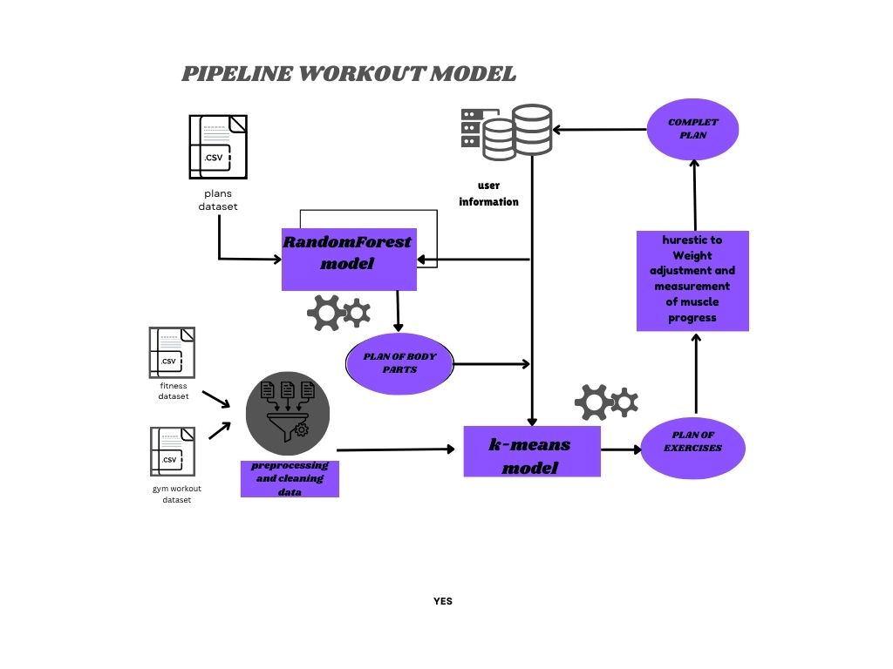

# Workout-Recommendation

This project provides a `FitnessModel` class that generates personalized fitness plans and exercise recommendations. It utilizes clustering classification and machine learning techniques to create dynamic workout routines based on user-specific inputs like fitness level, goals, gender, and equipment availability.

## Pipline

## Overview
The `FitnessModel` class allows you to:
- Choose a customized 30-day workout plan based on fitness level and goals.
- Get daily exercise recommendations based on location (home or gym) and available equipment.
- Adjust exercises, sets, repetitions, and weights according to the user's feedback and progress.
- Generate a complete workout routine, including body part adjustments, gender adjustments, and age-based intensity scaling.

## Features
- **30-Day Workout Plan Generation**: Create a full plan based on the user’s level and goal.
- **Exercise Recommendations**: Get specific exercise routines for each day.
- **Dynamic Adjustments**: Adjust exercises based on user feedback, fitness level, and available equipment.
- **Age, Gender, and Body Part Adjustments**: Tailor the workout intensity according to the user’s age, gender, and targeted body part.

